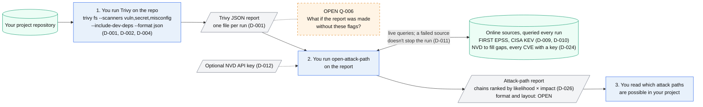

# End-to-end workflow

What the user does before and after open-attack-path, with the tool as one block. Based on decisions up to D-029. Dashed boxes are not decided yet.

```mermaid
---
config:
  flowchart:
    wrappingWidth: 600
---
flowchart LR
    repo[("Your project repository")]
    trivy["1. You run Trivy on the repo<br/>trivy fs --scanners vuln,secret,misconfig<br/>--include-dev-deps --format json<br/>(D-001, D-002, D-004)"]
    report[/"Trivy JSON report<br/>one file per run (D-001)"/]
    q6["OPEN Q-006<br/>What if the report was made<br/>without these flags?"]
    key[/"Optional NVD API key (D-012)"/]
    tool["2. You run open-attack-path<br/>on the report"]
    sources[("Online sources, queried every run<br/>FIRST EPSS, CISA KEV (D-009, D-010)<br/>NVD to fill gaps, every CVE with a key (D-024)")]
    out[/"Attack-path report<br/>chains ranked by likelihood × impact (D-026)<br/>format and layout: OPEN"/]
    act["3. You read which attack paths<br/>are possible in your project"]

    repo --> trivy --> report --> tool
    report -.- q6
    key -.-> tool
    tool <-->|"live queries; a failed source<br/>doesn't stop the run (D-011)"| sources
    tool --> out --> act

    classDef decided fill:#e8f1fb,stroke:#2563eb,color:#111
    classDef open fill:#fff4e5,stroke:#d97706,stroke-dasharray:5 5,color:#111
    classDef data fill:#f3f4f6,stroke:#6b7280,color:#111
    classDef external fill:#ecfdf5,stroke:#059669,color:#111
    class trivy,tool,act decided
    class q6 open
    class report,key,out data
    class repo,sources external
```
