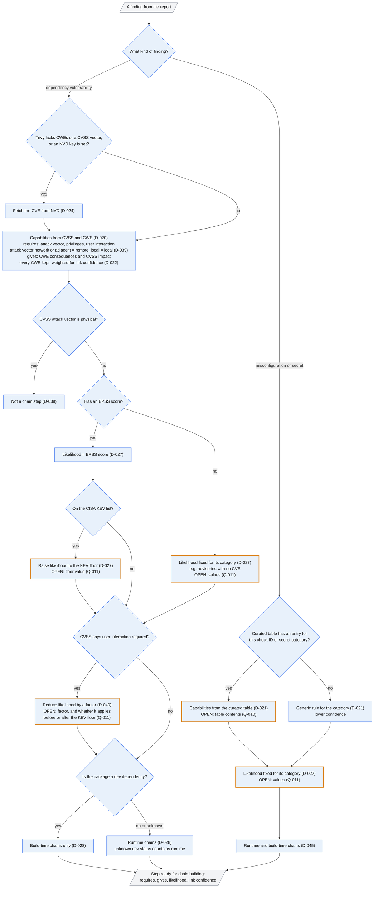

# Step decision tree

How one finding becomes a chain step: which rule sets its capabilities, which sets its likelihood, and which kind of chain it can join. Based on decisions up to D-045.

```mermaid
---
config:
  flowchart:
    wrappingWidth: 600
---
flowchart TB
    f[/"A finding from the report"/]
    k{"What kind of finding?"}

    nvdq{"Trivy lacks CWEs or a CVSS vector,<br/>or an NVD key is set?"}
    nvd["Fetch the CVE from NVD (D-024)"]
    vcap["Capabilities from CVSS and CWE (D-020)<br/>requires: attack vector, privileges, user interaction<br/>attack vector network or adjacent = remote, local = local (D-039)<br/>gives: CWE consequences and CVSS impact<br/>every CWE kept, weighted for link confidence (D-022)"]
    avq{"CVSS attack vector is physical?"}
    phys["Not a chain step (D-039)"]
    epq{"Has an EPSS score?"}
    eps["Likelihood = EPSS score (D-027)"]
    kevq{"On the CISA KEV list?"}
    kev["Raise likelihood to the KEV floor (D-027)<br/>OPEN: floor value (Q-011)"]
    cat1["Likelihood fixed for its category (D-027)<br/>e.g. advisories with no CVE<br/>OPEN: values (Q-011)"]
    uiq{"CVSS says user interaction required?"}
    ui["Reduce likelihood by a factor (D-040)<br/>OPEN: factor, and whether it applies<br/>before or after the KEV floor (Q-011)"]
    devq{"Is the package a dev dependency?"}
    bt["Build-time chains only (D-028)"]
    rt["Runtime chains (D-028)<br/>unknown dev status counts as runtime"]

    mtq{"Curated table has an entry for<br/>this check ID or secret category?"}
    cur["Capabilities from the curated table (D-021)<br/>OPEN: table contents (Q-010)"]
    gen["Generic rule for the category (D-021)<br/>lower confidence"]
    cat2["Likelihood fixed for its category (D-027)<br/>OPEN: values (Q-011)"]
    both["Runtime and build-time chains (D-045)"]

    done[/"Step ready for chain building:<br/>requires, gives, likelihood, link confidence"/]

    f --> k
    k -->|"dependency vulnerability"| nvdq
    nvdq -->|"yes"| nvd --> vcap
    nvdq -->|"no"| vcap
    vcap --> avq
    avq -->|"yes"| phys
    avq -->|"no"| epq
    epq -->|"yes"| eps --> kevq
    kevq -->|"yes"| kev --> uiq
    kevq -->|"no"| uiq
    epq -->|"no"| cat1 --> uiq
    uiq -->|"yes"| ui --> devq
    uiq -->|"no"| devq
    devq -->|"yes"| bt --> done
    devq -->|"no or unknown"| rt --> done

    k -->|"misconfiguration or secret"| mtq
    mtq -->|"yes"| cur --> cat2
    mtq -->|"no"| gen --> cat2
    cat2 --> both --> done

    classDef decided fill:#e8f1fb,stroke:#2563eb,color:#111
    classDef partial fill:#e8f1fb,stroke:#d97706,stroke-width:2px,color:#111
    classDef open fill:#fff4e5,stroke:#d97706,stroke-dasharray:5 5,color:#111
    classDef data fill:#f3f4f6,stroke:#6b7280,color:#111
    classDef external fill:#ecfdf5,stroke:#059669,color:#111
    class k,nvdq,epq,kevq,devq,mtq,avq,uiq,nvd,vcap,phys,eps,bt,rt,gen,both decided
    class kev,cat1,ui,cur,cat2 partial
    class f,done data
```
