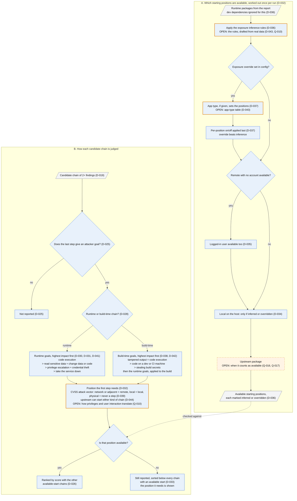

# Attacker model

Which starting positions are available for a run, and how each candidate chain's start and end are judged against them. Based on decisions up to D-045.

```mermaid
---
config:
  flowchart:
    wrappingWidth: 600
---
flowchart TB
    subgraph A["A. Which starting positions are available, worked out once per run (D-032)"]
        direction TB
        deps[/"Runtime packages from the report<br/>dev dependencies ignored for this (D-036)"/]
        infer["Apply the exposure inference rules (D-036)<br/>OPEN: the rules, drafted from real data (D-043, Q-010)"]
        ovq{"Exposure override set in config?"}
        app["App type, if given, sets the positions (D-037)<br/>OPEN: app-type table (D-043)"]
        per["Per-position on/off applied last (D-037)<br/>override beats inference"]
        remq{"Remote with no account available?"}
        login["Logged-in user available too (D-035)"]
        local["Local on the host: only if inferred or overridden (D-034)"]
        up["Upstream package<br/>OPEN: when it counts as available (Q-016, Q-017)"]
        pos[/"Available starting positions,<br/>each marked inferred or overridden (D-036)"/]

        deps --> infer --> ovq
        ovq -->|"yes"| app --> per --> remq
        ovq -->|"no"| remq
        remq -->|"yes"| login --> local
        remq -->|"no"| local
        local --> up --> pos
    end

    subgraph B["B. How each candidate chain is judged"]
        direction TB
        cand[/"Candidate chain of 2+ findings (D-019)"/]
        goalq{"Does the last step give an attacker goal? (D-025)"}
        drop["Not reported (D-025)"]
        kindq{"Runtime or build-time chain? (D-028)"}
        rtg["Runtime goals, highest impact first (D-030, D-031, D-041)<br/>code execution<br/>> read sensitive data ≈ change data or code<br/>> privilege escalation ≈ credential theft<br/>> take the service down"]
        btg["Build-time goals, highest impact first (D-038, D-042)<br/>tampered output = code execution<br/>> code on a dev or CI machine<br/>> stealing build secrets<br/>then the runtime goals, applied to the build"]
        first["Position the first step needs (D-032)<br/>CVSS attack vector: network or adjacent = remote, local = local,<br/>physical = never a step (D-039)<br/>upstream can start either kind of chain (D-044)<br/>OPEN: how privileges and user interaction translate (Q-010)"]
        stq{"Is that position available?"}
        main["Ranked by score with the other<br/>available-start chains (D-026)"]
        below["Still reported, sorted below every chain<br/>with an available start (D-033)<br/>the position it needs is shown"]

        cand --> goalq
        goalq -->|"no"| drop
        goalq -->|"yes"| kindq
        kindq -->|"runtime"| rtg --> first
        kindq -->|"build-time"| btg --> first
        first --> stq
        stq -->|"yes"| main
        stq -->|"no"| below
    end

    pos -.->|"checked against"| stq

    classDef decided fill:#e8f1fb,stroke:#2563eb,color:#111
    classDef partial fill:#e8f1fb,stroke:#d97706,stroke-width:2px,color:#111
    classDef open fill:#fff4e5,stroke:#d97706,stroke-dasharray:5 5,color:#111
    classDef data fill:#f3f4f6,stroke:#6b7280,color:#111
    classDef external fill:#ecfdf5,stroke:#059669,color:#111
    class ovq,per,remq,login,local,goalq,drop,kindq,rtg,btg,stq,main,below decided
    class infer,app,first partial
    class up open
    class deps,pos,cand data
```
